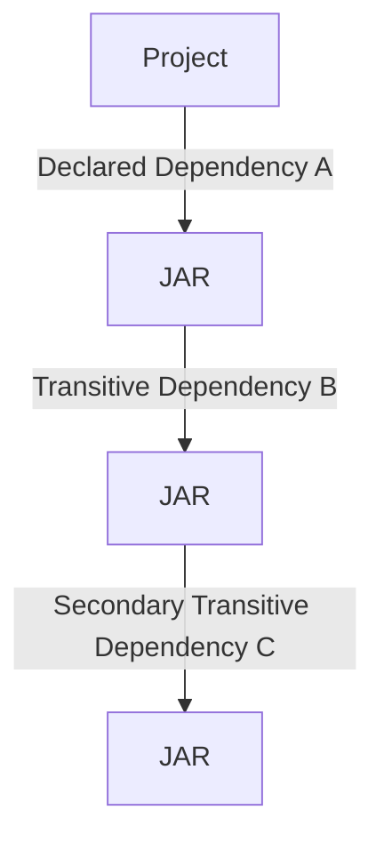
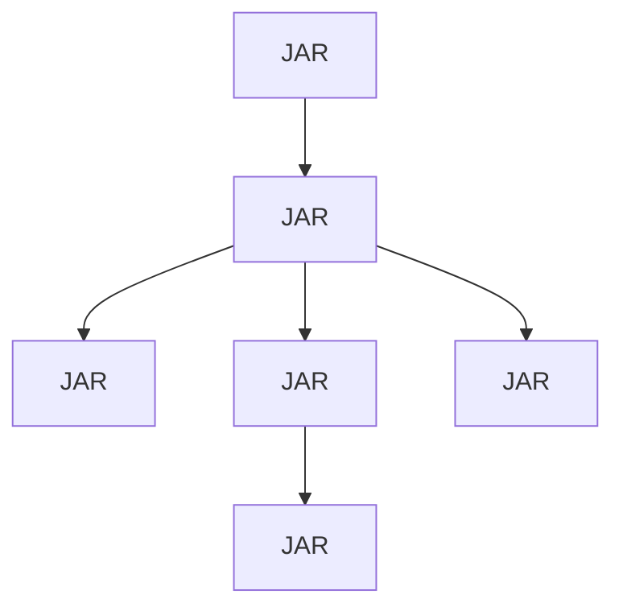

# Dependencies

- Dependency Management
- Finding Dependencies (External Repositories)
- Controlling When Used (Scopes)

## Dependency Management

- Main Strength of Maven
- Primary Dependency
  - Resolve Additional Dependencies

## Finding Dependencies (External Repositories)

- Maven Central
- Other Repositories
- Local First

## Dependency Scopes

- Six Scopes
  - Four commonly used
- Scopes:
  - **Compile** *(Most common)*
    - Default
    - Compilation and Execution
    - Added to Dependent Projects
  - **Test**  *(Most common)*
    - Testing Only
    - Not Needed
      - Compilation
      - Deployment / Runtime
  - **Runtime** *(Occasionally)*
    - Deployment / Runtime
    - Not Required for Compilation
    - Included in Containers (WAR/EAR)
  - **Provided** *(Occasionally)*
    - Provided by Target
      - Web Application
      - Application Server
        - e.g. Java Enterprise libraries
  - **System**
    - Rarely Used
    - Local Dependencies
      - e.g. Lib folder
    - Not Recommended
      - Unless Extreme Scenario
  - **Import**
    - Rarely Used
      - Almost Never
    - Specialized Cases
    - Replace Dependencies
